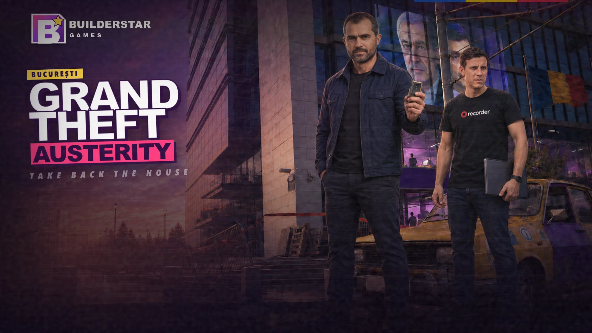
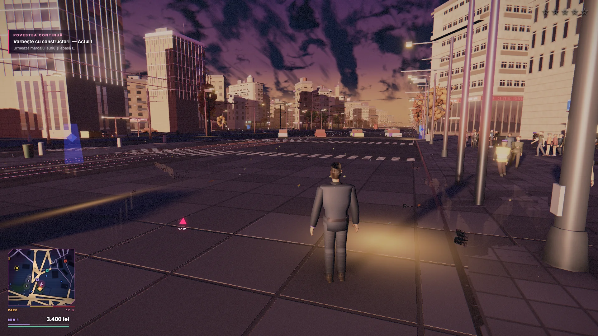
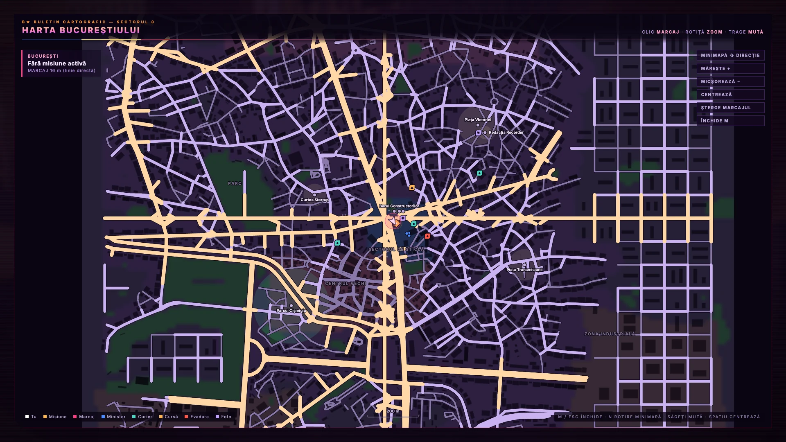
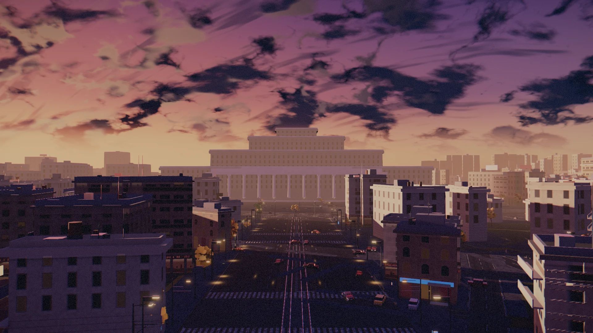
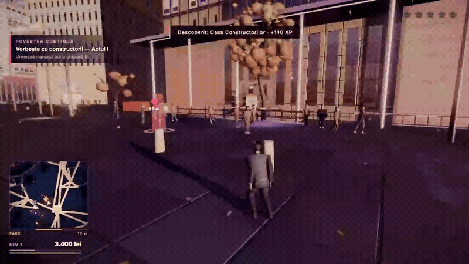
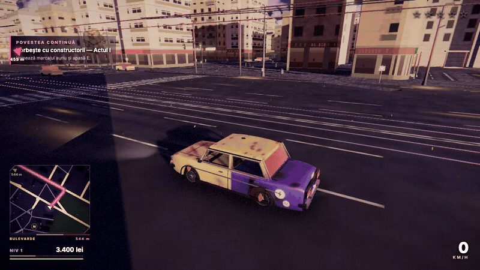

# Grand Theft Austerity: Open World

<p align="center">
  <strong><a href="https://gtausterity.vercel.app">▶ Play Grand Theft Austerity: Open World</a></strong>
</p>

> Take back the House. Now the whole city is in the way.

The open-world evolution of the original [Grand Theft Austerity AI Game Jam build](https://github.com/alexdevmotion/grand-theft-austerity). It keeps the same story, satire and central idea, then rebuilds the game around a proper explorable Bucharest.

<p align="center">
  
</p>

## What is it?

**Grand Theft Austerity: Open World** is a third-person political satire set in a living, stylised Bucharest. Fictional president George Georgescu closes Builders House and brands independent builders a threat to national stability. Ilie Bolojan-Agatinei answers by recovering the community's Last Server, collecting Recorder evidence and network credentials, hijacking the national broadcast, surviving the Ministry's escalating response and taking the House back from within.

That is the same premise and campaign spine as the [five-to-eight-minute hackathon original](https://github.com/alexdevmotion/grand-theft-austerity). This version gives the idea the world it was always asking for: streets to learn, districts to cross, characters to meet, systems to collide with and room to simply wander around Bucharest between missions.

<p align="center">
  
  
</p>

## From jam game to open world

| Original hackathon build | Open-world evolution |
| --- | --- |
| A compressed, linear slice of Bucharest | A large deterministic city generated from curated central-Bucharest OpenStreetMap data |
| A short story run | The same four-act campaign inside free roam, exploration and side activities |
| Essential mission characters | A full cast, crowds, pedestrians, police and character-specific dialogue |
| One mission route | Districts, landmarks, interiors, discoverable places and an interactive full-city map |
| A driveable Dacia | The Bootstrapped Dacia plus traffic, vehicle damage, recovery, trams and pursuit vehicles |
| Jam-scale presentation | A full front end, save/progression systems, weather, time of day, photo mode, radio and Romanian subtitles |

## The city

- **A Bucharest-shaped open world.** Real road topology, tram lines, parks, squares and landmark footprints are curated from OpenStreetMap, then rendered as an authored, procedural city rather than a photogrammetry dump.
- **Bucharest atmosphere.** Wet boulevards, overhead tram wires, battered facades, warm shopfronts, political posters, sodium streetlights, autumn trees and a violent magenta-orange sky.
- **Characters with a point of view.** Ilie Bolojan-Agatinei, George Georgescu, Alex Need-Aid, Nicușor LAN, builders, inspectors and street crowds inhabit the same satirical fiction as the original.
- **Free-roam systems.** On-foot movement and melee, arcade driving, traffic, trams, police response, five Crisis Stars, vehicle damage, side activities, progression and persistent saves.
- **A real game map.** Rotating minimap, north-up full map, landmarks, activities, mission markers, custom waypoints and routes calculated over the live road graph.
- **Places you can enter.** Builders House is a physical location with a sealed exterior, an enterable lobby and a finale that changes the space after liberation.
- **A city that changes mood.** Clear post-rain sunset, storms and night lighting are backed by procedural sky, weather, reflections, window light and a full post-processing stack.

<p align="center">
  
</p>

## Gameplay

<p align="center">
  
</p>

Watch the [higher-quality MP4 capture](docs/media/bucharest-run.mp4).

### Handbrake slide

Take the battered yellow-and-purple hero Dacia 1300 down a sunset boulevard, then hold **Space** to pull the handbrake and slide through the junction.

<p align="center">
  
</p>

Watch the [higher-quality MP4 capture](docs/media/bucharest-handbrake-slide.mp4).

## Run locally

Requires [Bun](https://bun.sh/) and a WebGL2-capable browser.

```sh
bun install
bun run dev
```

Open `http://localhost:5273`.

The in-game Controls page is the source of truth. The essentials are `WASD` to move or drive, mouse to look, `Shift` to sprint, `E`/`F` to interact or enter a vehicle, `M` for the map, `P` for photo mode and `Esc` for pause.

Before sending a change:

```sh
bun run typecheck
bun test
bun run build
```

The capture harness can also reproduce the game's standard visual test set while the dev server is running:

```sh
bun run shot
```

## How it is built

TypeScript, Vite and three.js render the game in WebGL2; Rapier powers physics; the city, characters, vehicles, weather, missions, UI and audio are independent systems joined through typed service contracts. See [the architecture notes](docs/ARCHITECTURE.md), [story spine](docs/STORY.md), [visual target](docs/VISUAL_TARGET.md) and [likeness/landmark brief](docs/LIKENESS.md).

## Origin and credits

The project began as **Grand Theft Austerity**, built with Codex + GPT-5.6 sol for [AI Game Jam #1](https://luma.com/tagpbosj?tk=EgBQt5). The [original repository](https://github.com/alexdevmotion/grand-theft-austerity) and [browser build](https://grand-theft-austerity.vercel.app/) preserve that first hackathon version.

- [Alex Constantin](https://github.com/alexdevmotion) — creator and developer
- [Adrian Ciubotaru](https://github.com/AdrianCiubotaru) — co-developer of the original hackathon version
- [pax-k](https://github.com/pax-k) — AI Game Jam organizer
- [Recorder](https://recorder.ro/), [Builders House](https://buildershouse.howtoweb.co/) and [How to Web](https://www.howtoweb.co/) — the civic and builder-community inspiration behind the parody
- [OpenStreetMap contributors](https://www.openstreetmap.org/copyright) — Bucharest map data, licensed under ODbL 1.0

This is an independent, non-commercial parody. All political characters are fictional composites and do not represent or imply endorsement by the people or organizations referenced.

## License

Source code is available under the [MIT License](LICENSE). OpenStreetMap-derived data and third-party studio references retain their own terms; see [reference and data attribution](docs/reference/ATTRIBUTION.md).
