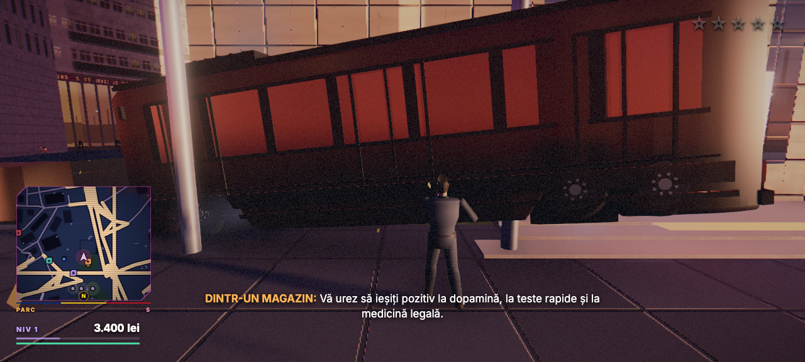
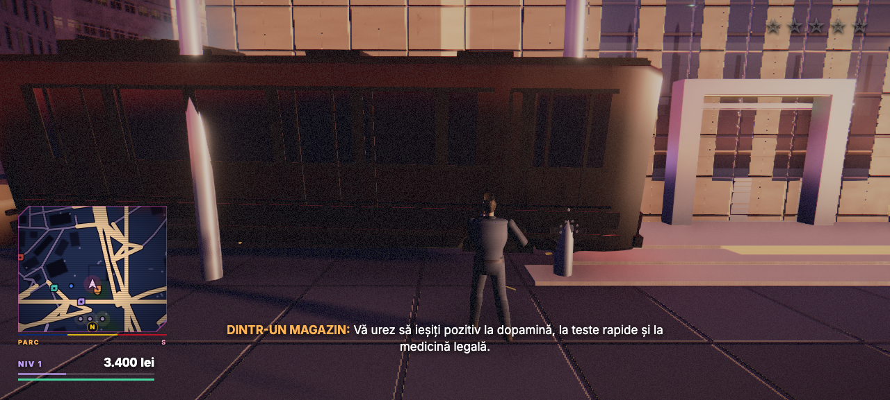
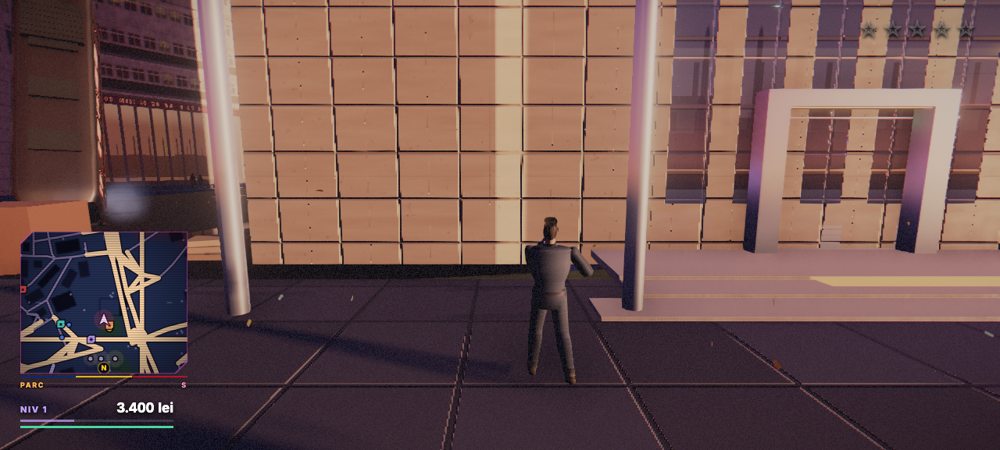
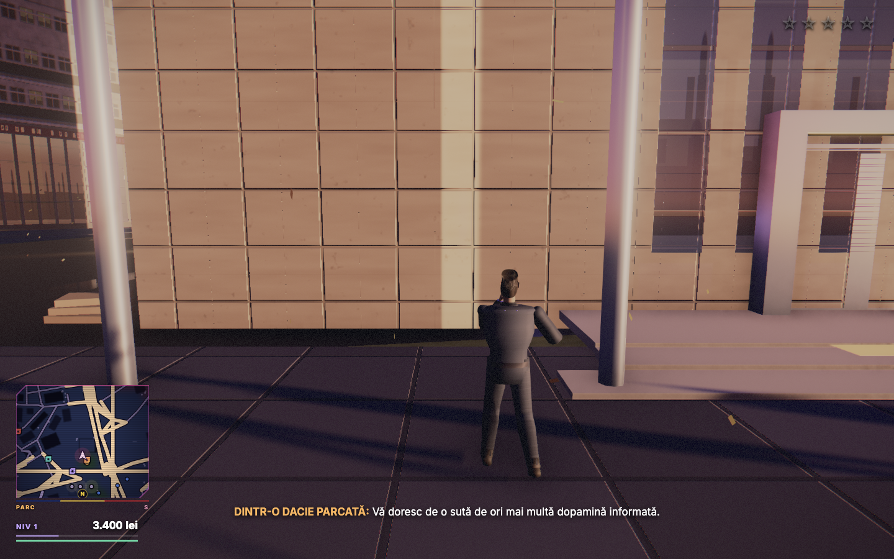
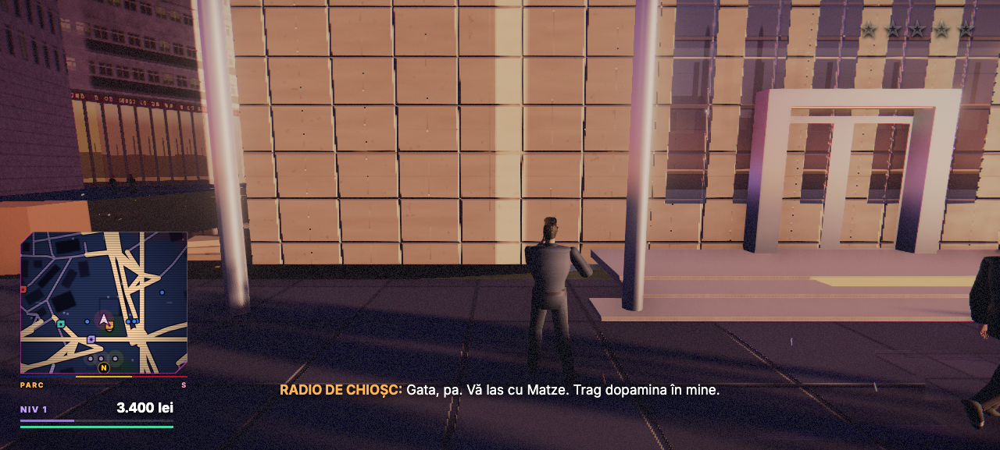
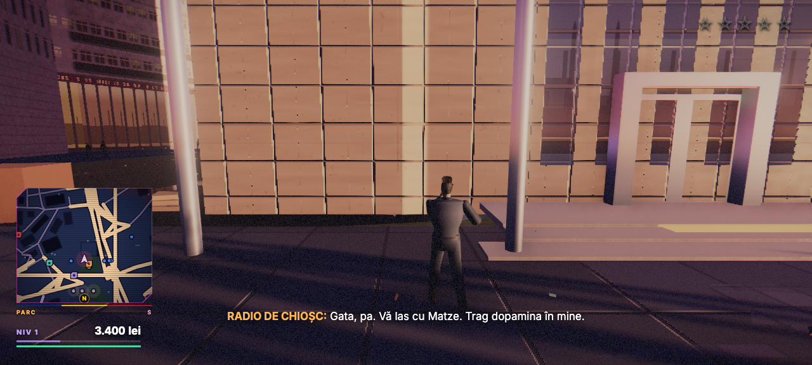
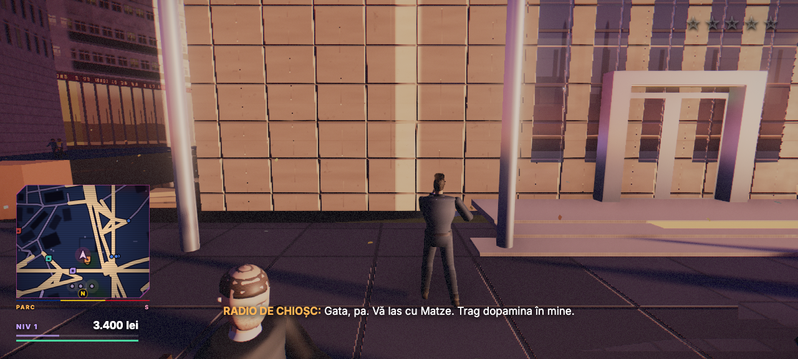
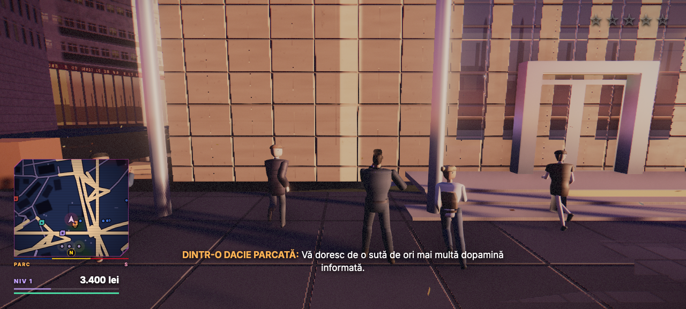
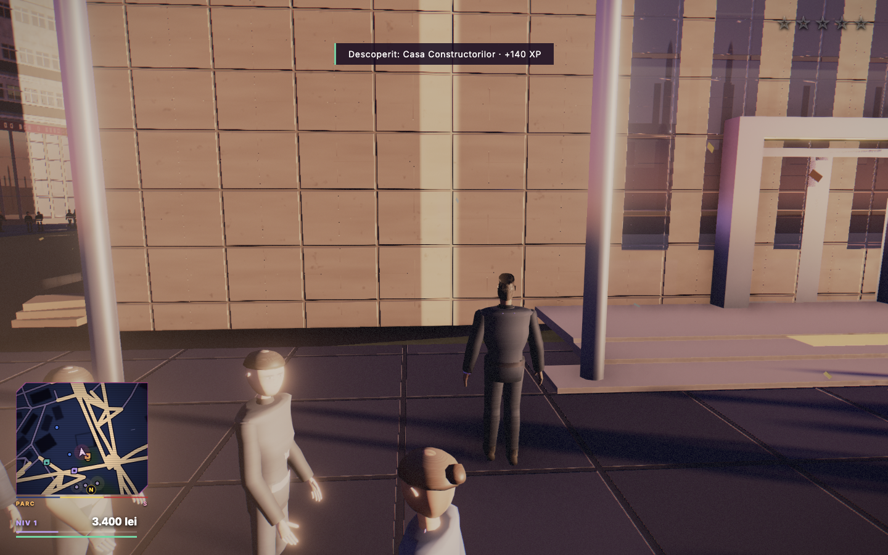
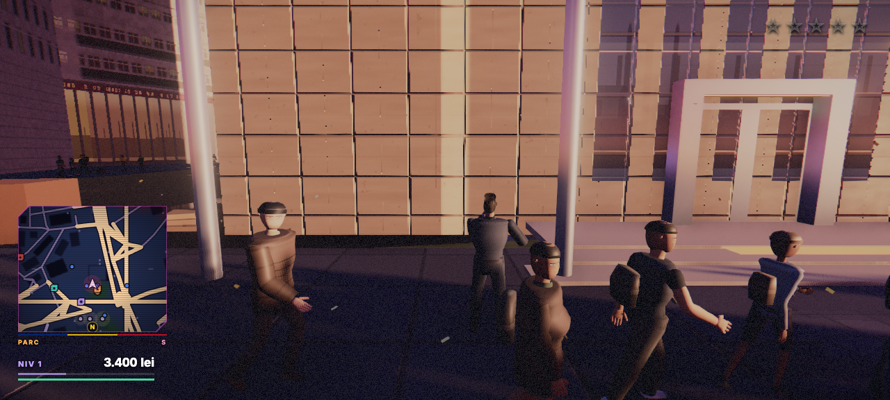

# Dogfood Report: Grand Theft Austerity Open World

| Field | Value |
|-------|-------|
| **Date** | 2026-07-31 |
| **App URL** | http://127.0.0.1:5273/ |
| **Session** | gta-open-world-baseline |
| **Scope** | Core gameplay: onboarding, traversal, NPC interaction/combat, trams, traffic/vehicles, character/camera, world coherence, audio, performance, and recovery |

## Summary

| Severity | Count |
|----------|-------|
| Critical | 0 |
| High | 3 |
| Medium | 2 |
| Low | 0 |
| **Total** | **5** |

## Issues

### ISSUE-001: Tram sweeps across the spawn pavement and facade instead of a valid rail corridor

| Field | Value |
|-------|-------|
| **Severity** | high |
| **Category** | functional / visual |
| **URL** | http://127.0.0.1:5273/ |
| **Repro Video** | N/A — the browser recorder failed to finalize this WebGL capture; sequential screenshots were retained |

**Description**

The tram is moving, but its route is invalid: the full car body traverses the pedestrian spawn area directly in front of Casa Constructorilor, intersects the entrance/facade line and lamp posts, and temporarily fills most of the camera. Its geometry/path do not read as a tram running on rails.

**Repro Steps**

1. Remain at the initial spawn until the tram enters from the right; its car body already spans the pavement and facade.
   

2. Wait 2.2 seconds; the tram continues laterally across the entrance and lamp-post line.
   

3. Wait for the rear of the tram to clear; it exits through the same sidewalk/facade corridor rather than a visible rail lane.
   

---

### ISSUE-002: Ambient audio subtitles are incoherent and context-free

| Field | Value |
|-------|-------|
| **Severity** | medium |
| **Category** | content / ux |
| **URL** | http://127.0.0.1:5273/ |
| **Repro Video** | N/A — static subtitle evidence is sufficient |

**Description**

Ambient sources repeatedly emit grammatically valid fragments whose meaning is nonsensical and unrelated to the visible world. Examples combine dopamine, drug tests, legal medicine, and a parked Dacia without a coherent joke or setup. The rapid unrelated source labels make the city feel like random text generation rather than spatial street audio.

**Repro Steps**

1. Wait at spawn for the parked-Dacia source: “Vă doresc de o sută de ori mai multă dopamină informată.”
   

2. Wait for the shop source: “Vă urez să ieșiți pozitiv la dopamină, la teste rapide și la medicină legală.”
   

3. Observe another unrelated kiosk line: “Gata, pa. Vă las cu Matze. Trag dopamina în mine.”
   

---

### ISSUE-003: Punches have no hit detection, damage, reaction, or consequence

| Field | Value |
|-------|-------|
| **Severity** | high |
| **Category** | functional |
| **URL** | http://127.0.0.1:5273/ |
| **Repro Video** | N/A — the browser recorder failed to finalize this WebGL capture; step screenshots were retained |

**Description**

The input layer already maps primary mouse and `Q` to a short punch animation, but the original player controller only requested that animation. It never queried the pedestrian system or applied damage. As a result, a visually plausible punch at close range cannot change NPC health/state, cause a hit reaction, or raise the wanted level. The manual screenshots did not reliably catch the 0.46-second animation; source tracing established the missing gameplay path.

**Repro Steps**

1. With pointer lock active, wait at spawn while pedestrians approach.
   

2. Press and release the primary mouse button (or press `Q`). No pedestrian health/state or wanted-level change follows.
   

3. Repeat while a pedestrian is within arm's reach. There is still no hit feedback or pedestrian reaction.
   

4. Nearby pedestrians continue their path unchanged and no combat state appears.
   

---

### ISSUE-004: Crowd models overlap and read as malformed mannequins

| Field | Value |
|-------|-------|
| **Severity** | medium |
| **Category** | visual |
| **URL** | http://127.0.0.1:5273/ |
| **Repro Video** | N/A — static visual evidence is sufficient |

**Description**

Pedestrians repeatedly occupy the same personal space and pass through the stationary player/crowd. Several heads are overexposed or disconnected-looking, torsos have extreme angular silhouettes, and clothing/limbs intersect. At normal gameplay distance the crowd reads as a collection of malformed mannequins rather than believable people.

**Repro Steps**

1. Load the game and wait at spawn; multiple pedestrians overlap one another immediately in the foreground.
   

2. Continue waiting; the crowd walks through the player's exact position while anatomies and clothing intersect.
   

---

### ISSUE-005: Traffic despawn can leave audio holding a freed Rapier body and crash the simulation

| Field | Value |
|-------|-------|
| **Severity** | high |
| **Category** | reliability / functional |
| **URL** | http://127.0.0.1:5273/ |
| **Repro Video** | N/A — captured in the dev-client runtime trace |

**Description**

During the extended driving/crowd session, `AudioSystem.updateVehicles` read `VehicleHandle.speed` from a traffic vehicle whose Rapier rigid body had already been removed. Rapier first threw `RuntimeError: unreachable` from `body.linvel()`; later physics steps then repeatedly failed with `recursive use of an object detected which would lead to unsafe aliasing in rust`. This stops the simulation rather than degrading one audio voice.

Source tracing found the lifecycle mismatch: audio assigns voices to ordinary unoccupied traffic, but vehicle despawn only invalidated the audio cache when that vehicle had previously been explicitly engine-bound. A normal voiced traffic despawn could therefore leave a stale handle until the next 10 Hz voice reassignment.

**Repro Evidence**

1. Run an extended free-roam/driving session so traffic streams in and out.
2. Observe the first runtime failure at `Vehicle.speed -> body.linvel()`, called by `AudioSystem.updateVehicles`.
3. Observe subsequent Rapier world-step failures after the stale-body access.

---

## Disproved Leads

### Avatar locomotion only appeared stationary under the follow camera

The initial screenshot comparison suggested that the avatar did not translate. The deterministic debug contract disproved that interpretation: after `window.__GTA_DEBUG__.setInput({ moveY: -1 })` for 1.2 seconds, `stats().playerPos` changed from `[-38.0000, 0.1700, 28.0000]` to `[-37.9946, 0.1700, 24.7105]`, a 3.29 m backward movement. The follow camera and repeating facade/paving pattern had masked the displacement. This is not counted as an issue and no locomotion fix is warranted from this evidence.
